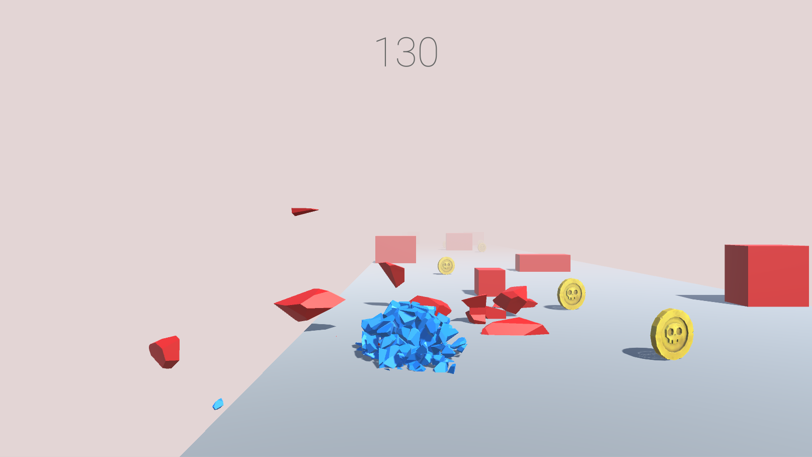

# NEGA-CUBE
A simple classic coin collect game developed in 2020. (Learning unity)
 
This is a simple coin collect game for my unity learning.

## Project description
Name: NEGA-CUBE  
Programming Language: C#  
Platform: PC game  
Project No: 21  
Year: 2020

## Demo Video

## Screen shot

## Authors

* **AbirHasan**

Check out my other works [@XAbirHasan](https://github.com/XAbirHasan)
